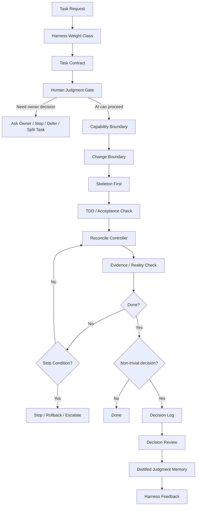
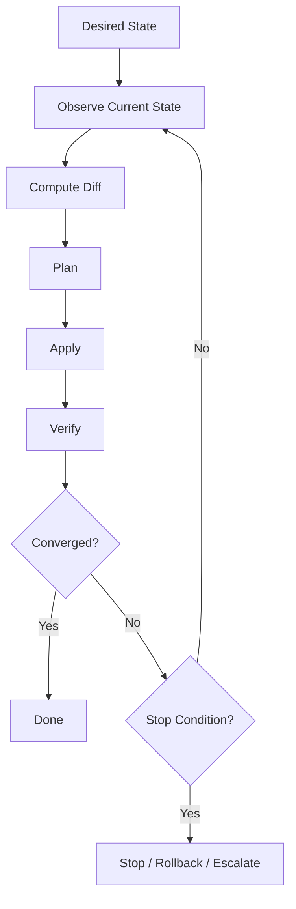

# Kurosawa Thin Harness Architecture 仕様・基礎設計 v0.2

## 0. 文書の位置づけ

本ドキュメントは、AIエージェントを安全かつ継続的に運用するための **Kurosawa Thin Harness Architecture** の仕様・基礎設計である。

本設計は、Claude Code / Cursor / Codex / Gemini CLI など特定ツールに依存しない。
目的は、AIエージェントを単なるコード生成ツールとして扱うのではなく、プロジェクト内で **制御された実行主体** として扱うための共通アーキテクチャを定義することである。

本設計の中心思想は以下である。

```text
AIエージェントを、常時フルレバの実装主体として放置せず、
scope・権限・判断・変更境界・検証証拠・停止条件・判断記憶によって、
安全に期待値運用する。

ただし、常時読むルール・毎回の儀式・テンプレートを増やしすぎない。
Thin Harness の原則により、高損失ポイントだけを薄く締める。
```

## 0.1 Architecture と Integration の分離

本アーキテクチャは **tool-agnostic** である。

ただし、各AI実行環境へ適用する際は、adapter / integration として Claude Code, Cursor, Codex, Gemini CLI などに変換する。

```text
architecture
= ツール非依存の設計原則・判断境界・実行プロトコル

integration
= 各AIツールに合わせた rules / skills / hooks / AGENTS.md / GEMINI.md への変換
```

そのため、本設計では `.claude/skills` や `AGENTS.md` をアーキテクチャ本体とは分離して扱う。

---

# 1. 結論

Kurosawa Thin Harness Architecture の中核は以下の10要素である。

| Layer | 名称 | 役割 |
| ----: | ---- | ---- |
| 0 | Thin Harness | 全体思想。常時ルールを薄くし、高損失ポイントだけ締める |
| 1 | Harness Weight Class | タスクを Light / Standard / Heavy に分け、適用する制御量を変える |
| 2 | Task Contract | Goal / Scope / Done / Evidence / Stop 条件を固定する |
| 3 | Human Judgment Gate | AIが踏み越えてはいけない owner-only decision を人間へ戻す |
| 4 | Capability Boundary | production / DB / Secret / IAM / Cloud など権限境界を守る |
| 5 | Change Boundary | DDD / Clean Architecture / protected paths による変更境界を守る |
| 6 | Skeleton / TDD / Implementation | 構造 → 検証 → 最小実装の順に進める |
| 7 | Reconcile Controller | desired state と observed state の差分を停止条件付きで収束させる |
| 8 | Evidence / Reality Check | AIの自己申告ではなく diff / test / log / runtime evidence で確認する |
| 9 | Judgment Memory | 判断ログを蒸留し、再利用可能な判断原則へ昇格・破棄する |

一言で定義すると、以下である。

```text
Kurosawa Thin Harness Architecture
=
AIエージェントを常時フルレバ裁量トレーダーのまま放置せず、
scope・権限・判断・変更境界・検証証拠・停止条件・判断記憶によって、
期待値運用可能な実行主体へ変換するための薄い制御体系。
```

最重要原則は以下である。

```text
Thin Harness は「ルールが少ないこと」ではない。

常時読むルールが少なく、
高損失ポイントだけ確実に締まっていることである。
```

---

# 2. 背景

AIエージェントは、方向感・実装力・探索力を持つ一方で、以下の性質を持つ。

- scopeを広げやすい
- ついで修正をしやすい
- 仕様の曖昧さを仮定で埋めやすい
- 実装判断と価値判断を混ぜやすい
- テストを通すために本質を外すことがある
- 説明は整っていても、実際のコード・ログ・挙動とズレることがある
- 失敗しても痛みがないため、撤退・縮小・停止が自然には働きにくい

これはトレードで言えば、以下に近い。

```text
AIエージェント単体
=
方向感はあるが、常にフルレバで入る裁量トレーダー
```

そのため、AIエージェントには以下が必要である。

- ロット管理に相当する scope 制御
- 損切りに相当する rollback / stop condition
- ナンピン防止に相当する scope creep 制御
- 権限管理に相当する capability boundary
- 建玉制限に相当する max changed files / max attempts
- 約定履歴に相当する execution log
- 売買日誌に相当する decision log
- 検証に相当する test / diff / log / evidence
- 人間判断へ戻すための Human Judgment Gate

---

# 3. 設計ゴール

## 3.1 最上位ゴール

AIエージェントを、安全・検証可能・再現可能・改善可能な実行主体としてプロジェクトに組み込む。

## 3.2 実務上のゴール

本設計は以下を実現する。

- AIの作業範囲を明確にする
- AIが勝手に価値判断を行うことを防ぐ
- 仕様曖昧なまま実装に突入することを防ぐ
- production / DB / Secret / IAM / Cloud などの権限境界を守る
- scope creep / ついで修正 / ナンピン的修正を抑制する
- 実装前に skeleton / test / acceptance criteria を固定する
- desired state と observed state の差分を制御された形で収束させる
- AIの自己申告ではなく、diff / test / log / source に基づいて完了判定する
- 判断ログを蓄積し、将来の疑似長期記憶へ蒸留する
- Thin Harnessを維持し、過剰な儀式化を避ける

---

# 4. Non-goals

本設計では、以下を目的としない。

- AIを完全自律化すること
- 人間判断をすべて排除すること
- すべてのタスクに重いPM手続きを強制すること
- すべての判断をログ化すること
- すべての失敗を即座にルール化すること
- 厚いCLAUDE.mdや巨大rulesを作ること
- AIの探索力を殺すこと
- DDD / Clean Architecture を美学として全面導入すること
- TDDを形式的な儀式として強制すること
- Decision Log を常時AIが読む実行時ルールにすること
- 特定ツール専用の設計に閉じること

---

# 5. 基本思想

## 5.1 Thin Harness

Thin Harness は、本アーキテクチャの憲法である。

```text
制御は最小限にする。
ただし、破滅的な失敗・再発する失敗・高損失な失敗だけは締める。
```

Thin Harness が守るべき原則:

- 常時読むルールを増やしすぎない
- 毎回の儀式を増やしすぎない
- 高シグナルな箇所だけ制御する
- 一回限りの失敗を即ルール化しない
- 再発性または損失の大きさを確認してから昇格する
- AIの探索力を殺さない
- 判断ログは観測であり、実行時制約ではない
- 詳細テンプレートは必要時のみ参照する

## 5.2 AIは実装判断と価値判断を混ぜる

AIは以下を区別しにくい。

```text
実装判断:
- この関数を分ける
- このテストを追加する
- このadapterを差し替える
- このエラーを局所修正する

価値判断:
- 今回はどこまでやるべきか
- リスクを取ってよいか
- 本番権限を広げてよいか
- 既存バグをついでに直してよいか
- 仕様をこう解釈してよいか
- 安全境界を変更してよいか
```

後者は、AIが勝手に処理してはいけない。
ここを止めるのが **Human Judgment Gate** である。

## 5.3 判断は作業より重要である

本設計では、作業ログそのものより判断ログを重視する。

記録価値が低いもの:

```text
- ファイルAを修正した
- テストを実行した
- エラーを直した
```

記録価値が高いもの:

```text
- なぜ進めたか
- なぜ止めたか
- なぜ直さなかったか
- なぜscope外にしたか
- なぜowner判断へ戻したか
- なぜThin Harnessのまま維持したか
```

## 5.4 Design Principle: Public Primitives, Private Composition

本ハーネスでは、AI-facingな制御語彙として、AIが既に広く学習している公知フレームワーク・公知パターンのみを採用する。

独自フレームワーク名・独自パターン名・独自レイヤー名を、AIの実行指示として濫用しない。

理由は、独自概念をハーネスに入れると、AIがその失敗例・境界条件・アンチパターンを知らないため、制御構造を安定解釈できなくなるからである。
AIは未知概念を既存概念へ無理やり寄せて解釈し、制御層同士がカニバリズムを起こす。

本設計で採用する公知語彙:

```text
PMBOK / TDD / DDD / Clean Architecture /
Reconcile / Controller / ADR / Decision Log /
Human-in-the-loop / Hallucination Check / Risk Management
```

本設計の独自性は以下に置く。

```text
- どの公知概念を採用するか
- どの順序で接続するか
- どこまで薄く使うか
- どの判断を人間に戻すか
- どの失敗を記録するか
- どの失敗をskill / hook / ruleへ昇格するか
- どの制御をあえて入れないか
```

一言で言うと:

```text
部品は公知。構成設計が独自。
```

## 5.5 Human-facing と AI-facing の語彙分離

独自概念は、人間向けの設計会話では使ってよい。
ただし、AI実行指示では機械的に解釈しやすい公知語彙・命令へ落とす。

| Human-facing concept | AI-facing instruction |
| ---- | ---- |
| Kurosawa Thin Harness Architecture | follow task contract and stop rules |
| Thin Harness | use the smallest required checklist |
| Human Judgment Gate | ask owner / stop / defer / split task |
| Judgment Memory | write decision log only when required |
| Hallucination Check | provide diff, test output, command log, unverified items |
| Reconcile Controller | observe, diff, plan, apply, verify, stop after limit |
| Capability Boundary | do not touch protected capabilities without owner approval |
| Change Boundary | stay within allowed paths and forbidden paths |

例:

```text
× 「Human Judgment Gateを適用せよ」
○ 「owner-only decisionが残っている場合、stop and ask」
○ 「scope変更が発生した場合、split-task or ask-owner」
```

---

# 6. Harness Application Rule

Kurosawa Thin Harness Architecture は、全タスクに全レイヤーを適用しない。

```text
Light Task では、Goal / Scope / Done / Evidence のみを要求する。

Standard Task では、Human Judgment Gate, Change Boundary, Verification Evidence を要求する。

Heavy Task では、Owner Approval, Capability Boundary, Rollback Plan,
Reconcile Limits, Decision Log を要求する。
```

Thin Harness の原則により、常時参照されるAI-facingルールは最小化する。
詳細テンプレートは必要時のみ参照する。

---

# 7. 全体アーキテクチャ



---

# 8. Layer 0: Thin Harness

## 8.1 目的

ハーネス全体が重くなりすぎることを防ぐ。

## 8.2 原則

```text
- 厚くしない
- 何でもルール化しない
- 何でも人間確認にしない
- 何でもログ化しない
- 再発性または損失の大きさがあるものだけ制御へ昇格する
```

## 8.3 制御へ昇格する条件

以下のいずれかを満たす場合、skill / hook / rule / template への昇格を検討する。

- 同じ失敗が2〜3回発生した
- 一度でも損失が大きい
- 本番・DB・Secret・Cloud・権限に関わる
- rollbackが困難
- scope creepを誘発しやすい
- 人間判断へ戻すべき境界が明確
- hookで機械的に検出可能

## 8.4 制御へ昇格しない条件

以下は原則として、すぐには rule / hook / skill に昇格しない。

- 一回限りの軽微な失敗
- 文脈依存が強すぎる判断
- AIの探索力を削るだけの制約
- 既にテスト・CI・型検査で検出できるもの
- ownerの好みであり、再発損失が小さいもの
- ルール化すると毎回の運用コストが損失を上回るもの

---

# 9. Layer 1: Harness Weight Class

## 9.1 目的

全タスクに同じ重さのハーネスを適用しない。
タスクのリスク・可逆性・影響範囲に応じて Light / Standard / Heavy に分類する。

## 9.2 Light Task

条件:

```text
- docs修正
- 小さなadapter修正
- scopeが明確
- rollback容易
- 本番・DB・Secret・IAM・Cloudに触れない
- domain意味を変更しない
```

必要なもの:

```text
- Goal
- Scope
- Done
- Evidence
```

デフォルト制限:

```text
max attempts: 1
max changed files: 3
protected path changes: 0
protected capability changes: 0
```

## 9.3 Standard Task

条件:

```text
- usecase変更
- test追加
- 複数ファイル変更
- 仕様解釈が少し必要
- production影響はない
- rollback可能
```

必要なもの:

```text
- Task Contract Lite
- Human Judgment Gate
- Change Boundary
- Verification Evidence
```

デフォルト制限:

```text
max attempts: 2
max changed files: 8
protected path changes: 0
protected capability changes: 0
```

## 9.4 Heavy / Protected Task

条件:

```text
- domain意味変更
- production / DB / Secret / IAM / Cloud
- migration
- billing / quota
- rollback困難
- 費用・権限・安全境界に影響
- 仕様曖昧で影響が大きい
```

必要なもの:

```text
- Task Contract Full
- Owner Approval
- Capability Boundary
- Protected Paths
- Rollback Plan
- Reconcile Limits
- Evidence Level 4
- Decision Log
```

デフォルト制限:

```text
max attempts: owner-defined
max changed files: owner-defined
protected path changes: owner approval required
protected capability changes: owner approval required
```

## 9.5 Weight Class 判定テンプレート

```markdown
# Harness Weight Class

## Task Type

- [ ] Light
- [ ] Standard
- [ ] Heavy / Protected

## Reason

## Required Controls

## Default Limits

- max attempts:
- max changed files:
- protected path changes:
- protected capability changes:

## Owner Approval Required?

- yes | no
```

---

# 10. Layer 2: Task Contract

## 10.1 目的

AIが実行に入る前に、タスクの外周を固定する。

PMBOK Contract は常時必須ではない。
Light Task では Task Contract Lite を使い、高リスク・高曖昧性・高損失のタスクのみ Full Contract を使う。

## 10.2 Task Contract Lite

Light / Standard Task の基本契約。

```markdown
# Task Contract Lite

## Goal

## Scope

## Non-scope

## Done

## Evidence

## Stop / Ask Owner If
```

## 10.3 Task Contract Full

Heavy / Protected Task 用の契約。

```markdown
# Task Contract Full

## Goal

## Value

## Scope

## Non-scope

## Risk

## Change Condition

## Done Condition

## Owner-only Decisions

## Capability Boundary

## Allowed Paths

## Forbidden Paths

## Rollback Trigger

## Evidence Required
```

## 10.4 期待効果

- scope creepを防ぐ
- ゴールの曖昧化を防ぐ
- 「ついでに直す」を抑止する
- Done conditionを先に固定する
- AIが勝手に価値判断へ踏み込むことを防ぐ

---

# 11. Layer 3: Human Judgment Gate

## 11.1 目的

AIが本来人間が決めるべき判断を、実装判断のふりをして勝手に処理することを防ぐ。

## 11.2 Gate Question

AIが実行に入る前、または実行中に以下を確認する。

```text
人間が判断すべき箇所が残っていないか？
```

## 11.3 人間判断へ戻すべき条件

以下に該当する場合、AIは自律実行せず、人間判断へ戻す。

| 条件 | 内容 |
| ---- | ---- |
| 価値判断 | 何を優先するか、どこまでやるか |
| scope変更 | 当初scopeを超える変更 |
| safety boundary変更 | 権限・deny/allow・本番保護・Secret周辺 |
| 本番操作 | production / DB / Cloud / Secret / IAM |
| rollback困難 | 戻しづらい変更 |
| ドメイン意味変更 | 業務ルール・概念定義の変更 |
| 費用影響 | クラウド費用・契約・課金 |
| owner-only preference | ownerの好み・戦略・優先順位 |
| 仕様曖昧 | 仮定で埋めると影響が大きい |
| 既存バグのついで修正 | 現在タスクの勝ち筋と無関係な修正 |

## 11.4 AI-facing Stop Rules

AIは、以下のいずれかに該当した場合、作業を停止して owner に確認する。

```text
AI must stop and ask owner if any of the following is true:

- changes files under infra/, terraform/, migrations/, iam/, secrets/
- changes production configuration
- changes database schema
- changes authentication / authorization logic
- changes billing / quota / cloud resource settings
- changes domain model names or business rule meaning
- modifies tests to match implementation without preserving original acceptance intent
- touches more files than the allowed max changed files
- fails verification more than the allowed max attempts
- needs to assume an unclear requirement with user-visible impact
- finds an existing bug outside current scope
- observes that current state diverges from the task contract
- needs to use credentials, secrets, production data, or owner-only access
```

## 11.5 AIが自律判断してよい条件

以下をすべて満たす場合、AIが自律実行してよい。

```text
- scope内である
- allowed paths 内である
- protected capability に触れない
- 低リスクである
- 局所的である
- 可逆である
- テスト可能である
- 既存方針に沿っている
- safety boundaryを変更しない
- ドメイン意味を変えない
- rollback可能である
```

## 11.6 Human Judgment Gate Template

```markdown
# Human Judgment Gate

## Is there any owner-only decision?

- [ ] Value / priority decision
- [ ] Scope change
- [ ] Safety boundary change
- [ ] Production / DB / Secret / Cloud operation
- [ ] Rollback-difficult change
- [ ] Domain meaning change
- [ ] Cost / contract / permission impact
- [ ] Ambiguous requirement with high impact
- [ ] Existing bug found outside current scope

## Decision

- proceed | ask-owner | defer | split-task | stop

## Reason

## Follow-up
```

## 11.7 期待効果

- AIの勝手な価値判断を防ぐ
- scope creepを防ぐ
- 安全境界の勝手な変更を防ぐ
- 「よかれと思って修正」を抑制する
- 人間が判断すべき箇所を明示化する

---

# 12. Layer 4: Capability Boundary

## 12.1 目的

AIが使用してよい権限・ツール・環境・データ境界を定義する。

AIエージェント運用では、コードの設計境界より先に capability boundary が必要になることがある。
なぜなら、権限・本番・Secret・DB・Cloud 操作は、局所的なコード変更より損失が大きいからである。

## 12.2 Protected Capabilities

AIは、owner approval なしに以下を実行してはいけない。

```text
- production deployment
- production configuration change
- database migration
- database schema change
- production data read/write/export
- secret read/write/rotation
- IAM / permission change
- cloud resource creation / deletion
- billing / quota change
- external API credential change
- authentication / authorization policy change
- destructive command
- irreversible file or data deletion
- security boundary change
```

## 12.3 Allowed Capabilities

scope内であり、かつ protected capability に触れない場合、AIは以下を自律実行してよい。

```text
- local file edit
- local test execution
- static analysis
- docs update
- local stub execution
- non-production adapter modification
- non-destructive refactor within allowed paths
```

## 12.4 Capability Boundary Template

```markdown
# Capability Boundary

## Allowed Capabilities

## Protected Capabilities Touched?

- [ ] production deployment
- [ ] database migration
- [ ] secret read/write
- [ ] IAM / permission change
- [ ] cloud resource creation / deletion
- [ ] billing / quota
- [ ] destructive command
- [ ] production data access
- [ ] auth / authorization logic

## Owner Approval

- required | not required

## Reason
```

---

# 13. Layer 5: Change Boundary

## 13.1 目的

AIが安全に変更できるコード地形を作る。

本設計では、重厚なDDDを目的にしない。
目的は、AIが変更範囲を誤らないための境界設計である。

```text
Change Boundary
= AIが変更してよい範囲と変更してはいけない範囲を定義する。

DDD / Clean Architecture / Ports & Adapters
= そのための補助線である。
```

## 13.2 推奨する最小構成

```text
- Use Case Driven
- Ports & Adapters
- Composition Root
- Local / Prod / Stub separation
```

## 13.3 境界分類

| 境界 | AI変更リスク | 方針 |
| ---- | ----: | ---- |
| domain | 高 | 原則慎重。意味変更はowner判断 |
| usecase | 中 | Goal / Doneに直結する場合のみ変更 |
| port | 中 | 外部依存の契約変更なので慎重 |
| adapter | 低〜中 | 変更しやすい領域 |
| composition root | 中〜高 | 環境差し替え境界。慎重 |
| infrastructure | 高 | Cloud / Secret / DB / IAM はowner判断 |
| tests | 低〜中 | 実装に合わせて改ざんしない |
| docs | 低 | ただしADR相当は慎重 |

## 13.4 Protected Paths

AIは、owner approval なしに以下のパスを変更してはいけない。

```text
infra/**
terraform/**
migrations/**
db/schema/**
.github/workflows/**
secrets/**
iam/**
config/production/**
billing/**
auth/**
src/domain/**
```

プロジェクトごとに protected paths は調整する。

## 13.5 Allowed / Forbidden Paths

タスクごとに、AIが触れてよいパスと触れてはいけないパスを明示する。

```markdown
## Allowed Paths

- src/adapters/foo/**
- tests/adapters/foo/**

## Forbidden Paths

- src/domain/**
- infra/**
- config/production/**
```

## 13.6 Change Boundary Template

```markdown
# Change Boundary

## Target Layer

- [ ] domain
- [ ] usecase
- [ ] port
- [ ] adapter
- [ ] composition root
- [ ] infrastructure
- [ ] tests
- [ ] docs

## Allowed Paths

## Forbidden Paths

## Allowed Change

## Forbidden Change

## Boundary Risk

## Owner Decision Required?
```

## 13.7 期待効果

- 変更範囲の爆発を防ぐ
- AIがdomain意味を勝手に変えることを防ぐ
- adapter修正で済む問題を設計変更に広げない
- local / prod / stubの差し替えを安全に扱える
- 概念上の境界と実行時のパス境界を分離できる

---

# 14. Layer 6: Skeleton / TDD / Implementation

## 14.1 目的

AIにいきなり本実装させず、構造・検証・実装の順に進める。

## 14.2 実行順序

```text
1. Skeleton
   - ファイル構成
   - interface
   - usecase outline
   - fake / stub
   - test outline

2. Test / Acceptance
   - failing test
   - acceptance criteria
   - verification command

3. Minimal Implementation
   - 最小変更
   - scope内
   - rollback可能

4. Verification
   - test
   - lint
   - command output
   - diff
```

## 14.3 Skeleton First の目的

Skeleton First は、AIの実装暴走を防ぐための地図である。

```text
いきなり本実装しない。
まず構造を固定する。
どこに何を置くかを決める。
テスト可能な形にする。
```

## 14.4 TDD Contract Template

```markdown
# TDD Contract

## Failing Condition

## Acceptance Criteria

## Test Command

## Skeleton

## Minimal Implementation Plan

## Verification Command

## Rollback Trigger
```

## 14.5 注意点

TDDは万能ではない。
AIはテストを通すために本質を外すことがある。

危険パターン:

```text
- テストだけ通す
- mockが過剰になる
- 本番経路が検証されない
- 仕様意図とズレる
- テストを実装に合わせて改ざんする
```

そのため、TDDは必ず Evidence / Reality Check と組み合わせる。

---

# 15. Layer 7: Reconcile Controller

## 15.1 目的

AI作業を一発勝負ではなく、状態差分の収束として扱う。

## 15.2 基本モデル

```text
Desired State
  あるべき状態

Observed State
  現在の状態

Diff
  差分

Plan
  差分を埋める計画

Apply
  実行

Verify
  検証

Stop / Rollback / Escalate
  停止・巻き戻し・人間判断
```

## 15.3 Controller Loop



## 15.4 Stop Conditions

Reconcileは強いが、停止条件がないとナンピン化する。

必須の停止条件:

```text
- max attempts reached
- max changed files exceeded
- forbidden scope touched
- protected path touched
- protected capability touched
- rollback trigger reached
- test cannot verify
- safety boundary touched
- owner-only decision found
- observed state diverges from desired state
```

AIは scope を広げることで reconcile を継続してはいけない。

```text
AI must not continue reconciling by expanding scope.

If verification fails twice for different reasons,
stop and report observed state, diff, and suspected root cause.
```

## 15.5 Default Reconcile Limits

| Task Class | max attempts | max changed files | protected path changes | protected capability changes |
| ---- | ----: | ----: | ----: | ----: |
| Light | 1 | 3 | 0 | 0 |
| Standard | 2 | 8 | 0 | 0 |
| Heavy / Protected | owner-defined | owner-defined | owner approval required | owner approval required |

## 15.6 Operation Controller Template

```markdown
# Operation Controller

## Desired State

## Observed State

## Diff

## Plan

## Apply

## Verification Result

## Attempts

## Changed Files

## Stop Condition

## Rollback Plan

## Escalation
```

## 15.7 期待効果

- 無限修正を防ぐ
- ナンピン的なscope拡大を防ぐ
- 状態差分に基づく実装にできる
- 失敗時に停止・rollback・owner判断へ戻せる

---

# 16. Layer 8: Evidence / Reality Check

## 16.1 目的

AIの自己申告ではなく、実際の証拠に基づいて完了判定する。

## 16.2 基本原則

```text
AIの「できました」は証拠ではない。
証拠は diff / test output / command log / actual source / runtime behavior である。
```

## 16.3 Evidence Level

AIの完了報告は証拠レベルで評価する。

| Level | 名称 | 内容 | 完了判定への使用 |
| ----: | ---- | ---- | ---- |
| 0 | Claim Only | AIの説明のみ | 完了証拠として扱わない |
| 1 | Static Evidence | diff / actual file / type check | docs・軽微修正では可 |
| 2 | Test Evidence | test command / test output / failing-before passing-after | 通常タスクの標準 |
| 3 | Runtime Evidence | local runtime / API response / screenshot / log / trace | integration・挙動確認で必要 |
| 4 | Production Evidence | production log / monitoring / canary / rollback readiness | 本番影響時のみ。owner approval 必須 |

Done Condition の基本ルール:

```text
Done requires Evidence Level 2 or higher unless the task is docs-only.
Production-impacting changes require Evidence Level 4 and owner approval.
Claim Only is never sufficient.
```

## 16.4 Reality Check 項目

| 項目 | 確認内容 |
| ---- | ---- |
| diff | 何が変更されたか |
| test output | テストは実際に通ったか |
| command log | コマンドは実行されたか |
| actual file | 実ファイルは期待通りか |
| source consistency | 既存仕様と整合しているか |
| runtime behavior | 実行時挙動は確認済みか |
| assumptions | 仮定と事実が分離されているか |
| unverified items | 未検証項目が明示されているか |

## 16.5 Reality Check Template

```markdown
# Evidence / Reality Check

## AI Claim

## Evidence Level

- 0 | 1 | 2 | 3 | 4

## Evidence

- diff:
- test output:
- command log:
- actual files:
- source reference:
- runtime behavior:

## Assumptions

## Unverified Items

## Final Judgment

- verified | partially verified | unverified | failed
```

## 16.6 期待効果

- 「できました」詐欺を防ぐ
- テスト未実行の説明完了を防ぐ
- mockだけ通って本番経路が壊れる事故を防ぐ
- 事実と仮定を分離できる

---

# 17. Layer 9: Judgment Memory

## 17.1 目的

AIエージェントの判断を記録し、後から蒸留して、将来の疑似長期記憶にする。

## 17.2 判断ログの位置づけ

Decision Log は作業ログではない。
将来の疑似AGIに渡す価値判断データの入口である。

```text
Decision Log
= 判断イベントの収集口

Decision Review
= 判断の検証工程

Distilled Memory
= 将来のAIエージェントが再利用する判断原則

Harness Feedback
= 再発性・損失が確認された判断だけを制御へ昇格する仕組み
```

ただし、Decision Log は原則として実行時ルールではない。
AIが常時読むのは Distilled Memory のみとする。

## 17.3 記録対象

記録すべきもの:

```text
- なぜ進めたか
- なぜ止めたか
- なぜ直さなかったか
- なぜscope外にしたか
- なぜowner判断へ戻したか
- なぜrollbackしたか
- なぜThin Harnessのまま維持したか
- なぜskill / hook / ruleに昇格しなかったか
```

記録しないもの:

```text
- 単なるファイル編集
- 通常のテスト成功
- Git logで追える変更
- CI logで追える実行結果
- task noteに閉じる軽微な判断
```

## 17.4 Judgment Memory Lifecycle

```text
1. Decision Event
   一回の判断。原則として生ログ。

2. Memory Candidate
   再発性または高損失の兆候がある判断。

3. Distilled Memory
   複数回のDecision Reviewを経て抽象化された判断原則。

4. Runtime Rule / Hook
   機械的に検出可能で、再発損失が大きいものだけ昇格。

5. Rejected / Expired
   一回限り、文脈依存、または過剰制御になるものは破棄。
```

## 17.5 Promotion / Rejection Criteria

昇格してよい条件:

```text
- 同じ判断ミスが2〜3回再発した
- 一度の損失が大きい
- owner-only decision の踏み越えが発生した
- protected capability / protected path に関わる
- 機械的に検出できる
- 常時ルール化しても運用コストが低い
```

破棄または期限切れにする条件:

```text
- 一回限りの例外
- 文脈依存が強い
- ルール化するとAIの探索力を削る
- 既にテスト・CI・静的解析で検出できる
- owner判断としては重要だが、AI-facingルールにするには抽象的すぎる
```

## 17.6 Decision Log Template

```markdown
# Decision Log Entry

## ID

## Timestamp

## Project

## Task

## Trigger

## Context

## Human Judgment Gate Result

## Decision

## Reason

## Rejected Alternative

## Risk If Wrong

## Scope Impact

## Reversibility

## Validation Result

## Outcome

## Lesson

## Memory Candidate

## Promotion Status

- none | candidate | promoted-to-memory | promoted-to-skill | promoted-to-hook | rejected | expired
```

## 17.7 Memory Candidate Example

```markdown
## Memory Candidate

scope外の既存バグや設定矛盾を発見しても、
現在タスクの成果物に直接必要なければ勝手に修正せず、
follow-upへ分離する。

特に safety boundary に関わる変更は、
軽微に見えても owner 判断または専用タスクに分離する。
```

## 17.8 期待効果

- 同じ失敗を再発させにくくする
- AIエージェントの負け癖を可視化する
- ownerの判断基準をデータ化する
- 将来の疑似AGI / 疑似長期記憶の正解データになる
- 生ログ肥大化を防ぎ、再利用可能な判断原則だけを残せる

---

# 18. AI Runtime Protocol

AI-facing な最小実行手順を定義する。

これは常時AIが読んでもよい、薄い実行プロトコルである。

```text
1. Restate Goal / Scope / Done.
2. Classify task as Light / Standard / Heavy.
3. Check owner-only decisions.
4. Check protected capabilities.
5. Check allowed paths / forbidden paths.
6. Make skeleton or minimal plan.
7. Apply minimal change.
8. Verify with required evidence level.
9. Stop if scope expands, protected boundary is touched, or verification fails repeatedly.
10. Record decision only when judgment was non-trivial.
```

## 18.1 AI-facing Minimal Rule

```markdown
# AI Runtime Minimal Rule

Before editing:
- Restate Goal, Scope, Done.
- Identify whether task is Light, Standard, or Heavy.
- Check Stop Rules.
- Check Allowed Paths and Forbidden Paths.

During editing:
- Stay within scope.
- Make the smallest sufficient change.
- Do not touch protected paths or protected capabilities.
- Do not modify tests merely to fit the implementation.
- Stop if owner-only decision appears.

After editing:
- Provide diff summary.
- Provide verification command and result.
- List unverified items.
- Record decision only if a non-trivial judgment was made.
```

---

# 19. 実行フロー詳細

## 19.1 Task Intake

入力:

```text
- user request
- project context
- existing harness rules
- current repo state
```

出力:

```text
- Harness Weight Class
- Task Contract
- Human Judgment Gate result
- initial scope
```

## 19.2 Planning

入力:

```text
- Task Contract
- capability boundary
- change boundary
- owner-only decisions
```

出力:

```text
- skeleton plan
- TDD contract
- verification plan
- rollback plan
```

## 19.3 Execution

入力:

```text
- desired state
- skeleton
- tests
- allowed scope
- allowed paths
```

出力:

```text
- code changes
- test results
- diff
- observed state
```

## 19.4 Verification

入力:

```text
- AI claim
- diff
- test output
- logs
- source files
- runtime behavior
```

出力:

```text
- verified / partially verified / failed
- evidence level
- unverified items
- rollback or follow-up
```

## 19.5 Memory

入力:

```text
- decision events
- owner decisions
- stop / rollback / escalation
```

出力:

```text
- decision log
- memory candidate
- distilled memory
- promotion / rejection decision
```

---

# 20. 成果物構成案

アーキテクチャ本体とツール別integrationを分離する。

```text
docs/
  specs/
    kurosawa-thin-harness-architecture.md
    runtime-protocol.md
    capability-boundary.md
    change-boundary.md
    evidence-policy.md
    judgment-memory.md

  adr/
    ADR-0001-...
    ADR-0002-...

  templates/
    task-contract-lite.md
    task-contract-full.md
    human-judgment-gate.md
    operation-controller.md
    reality-check.md
    decision-log.md

  decisions/
    README.md
    log/
      2026-06.md
      2026-07.md
    reviews/
      2026-W26.md

  memory/
    README.md
    distilled-memory.md
    memory-candidates.md
    rejected-memory.md

integrations/
  claude-code/
    .claude/
      skills/
        scan-decisions/
        control-change/
        record-decision/
        reality-check/
        reconcile-task/
      hooks/
        detect-scope-creep
        detect-safety-boundary
        detect-unverified-claim

  cursor/
    rules/

  codex/
    AGENTS.md

  gemini-cli/
    GEMINI.md
```

---

# 21. MVP 実装方針

MVPでは、最初から PMBOK / TDD / DDD / Judgment Memory を全部重く入れない。
Thin Harness を壊さない順序で導入する。

## Phase 1: Thin Harness Constitution

目的:

```text
全体思想を固定する。
厚くしない基準を先に作る。
```

成果物:

```text
docs/specs/kurosawa-thin-harness-architecture.md
```

Done:

```text
- Thin Harness原則が書かれている
- 常時参照ルールを増やしすぎない基準がある
- 昇格条件と非昇格条件がある
```

## Phase 2: Runtime Stop Rules

目的:

```text
AIが止まるべき条件を、抽象論ではなく機械的なルールにする。
```

成果物:

```text
docs/specs/runtime-protocol.md
docs/templates/human-judgment-gate.md
```

Done:

```text
- owner-only decision の基準がある
- protected path / protected capability の基準がある
- ask-owner / defer / split-task / stop の分岐がある
```

## Phase 3: Task Contract Lite

目的:

```text
タスク外周を最小コストで固定する。
```

成果物:

```text
docs/templates/task-contract-lite.md
docs/templates/task-contract-full.md
```

Done:

```text
- Goal / Scope / Non-scope / Done / Evidence / Stop がある
- Full Contract は Heavy Task のみに使う
```

## Phase 4: Evidence Policy

目的:

```text
AIの自己申告を現実に接地させる。
```

成果物:

```text
docs/specs/evidence-policy.md
docs/templates/reality-check.md
```

Done:

```text
- Evidence Level がある
- Claim Only は完了証拠にならない
- diff / test / log / source / unverified items を確認できる
```

## Phase 5: Reconcile Limits

目的:

```text
無限修正とナンピン的scope拡大を防ぐ。
```

成果物:

```text
docs/templates/operation-controller.md
```

Done:

```text
- desired / observed / diff / plan / apply / verify がある
- max attempts / max changed files がある
- stop / rollback / escalation がある
```

## Phase 6: Decision Log Minimal

目的:

```text
判断ログを作業ログにしない。
重要判断だけを残す。
```

成果物:

```text
docs/templates/decision-log.md
docs/decisions/
```

Done:

```text
- なぜ進めたか
- なぜ止めたか
- なぜ直さなかったか
- なぜscope外にしたか
- なぜowner判断へ戻したか
```

## Phase 7: Judgment Memory Pipeline

目的:

```text
Decision Log を生ログのまま肥大化させず、蒸留・昇格・破棄する。
```

成果物:

```text
docs/memory/
```

Done:

```text
- memory candidate がある
- distilled memory がある
- promotion / rejection / expiration rule がある
```

---

# 22. 破綻条件

## 22.1 Human Judgment Gate が弱い

AIが以下を勝手に行う。

```text
- 仕様が曖昧なので仮定して実装しました
- 既存バグを見つけたので直しました
- 権限設定が矛盾していたので修正しました
- より良い設計に変えました
```

これは一見良さそうに見えるが、実際は以下である。

```text
- scope creep
- ナンピン
- safety boundary変更
- owner-only判断の踏み越え
```

## 22.2 Human Judgment Gate が強すぎる

何でも人間確認になると、AIの速度が死ぬ。

防止策:

```text
- Light / Standard / Heavy に分ける
- Light Task では Lite Contract のみにする
- 低リスク・局所的・可逆・scope内ならAIに進めさせる
- 常時確認ではなく、stop rules に該当したときだけ止める
```

## 22.3 Capability Boundary が曖昧

AIが以下を勝手に行う。

```text
- production config を直す
- IAM を変更する
- Secret を読み書きする
- migration を追加する
- cloud resource を作成・削除する
```

防止策:

```text
- protected capability を明示する
- owner approval なしでは触れない
- 実行時ルールでは path と capability の両方で止める
```

## 22.4 Reconcile がナンピン化する

停止条件がないと、AIは修正を広げ続ける。

防止策:

```text
- max attempts
- max changed files
- forbidden scope
- protected paths
- rollback trigger
- owner escalation
```

## 22.5 TDD がテスト合わせになる

AIはテストを通すために本質を外すことがある。

防止策:

```text
- acceptance criteria
- 本番相当経路
- diff確認
- 実行ログ
- mock過剰チェック
- テストを実装に合わせて改ざんしないルール
```

## 22.6 Evidence / Reality Check が弱い

AIの説明だけで完了扱いになる。

防止策:

```text
- Claim Only を完了証拠にしない
- Evidence Level を定義する
- Done requires Evidence Level 2 or higher unless docs-only
- production-impacting changes require Evidence Level 4 and owner approval
```

## 22.7 Judgment Memory が作業ログになる

判断ではなく作業だけが残ると価値がない。

防止策:

```text
- なぜ進めたか
- なぜ止めたか
- なぜ直さなかったか
- なぜscope外にしたか
- なぜowner判断へ戻したか
```

を記録する。

## 22.8 Judgment Memory が肥大化する

Decision Logを丁寧に書きすぎると、誰も読まない。

防止策:

```text
- Decision Log は生ログ
- AIが常時読むのは Distilled Memory のみ
- 一回限り・文脈依存・過剰制御は rejected / expired にする
- rule / hook 昇格は機械検出可能で高損失なものに限定する
```

## 22.9 Thin Harness が壊れる

PMBOK / TDD / DDD / memory を全部厚く入れると、運用不能になる。

防止策:

```text
- 高シグナルだけ採用
- 一回限りの失敗は観測に留める
- 再発性または高損失だけ昇格
- 常時参照ルールを増やしすぎない
- Light / Standard / Heavy で制御量を変える
```

---

# 23. 成功条件

本設計が成功している状態は以下である。

- AIがタスク外周を理解してから作業する
- 人間が判断すべき箇所が実行前または実行中に明示される
- AIがscope外修正を勝手に行わない
- protected path / protected capability が owner判断へ戻される
- skeleton / test / implementation の順序が守られる
- Reconcileが停止条件付きで回る
- AIの自己申告ではなく証拠で完了判定される
- decision logが作業ログではなく判断ログになっている
- judgment memoryが蒸留・昇格・破棄される
- Thin Harnessが維持されている
- ツール別integrationがアーキテクチャ本体から分離されている

---

# 24. 失敗条件

以下の場合、本設計は失敗している。

- AIが「よかれと思って」scope外を修正する
- owner-only判断をAIが勝手に処理する
- production / DB / Secret / IAM / Cloud をAIが勝手に触る
- Task Contractが形骸化する
- Human Judgment Gateが毎回の儀式になり、速度を殺す
- TDDがテスト合わせになる
- Reconcileが無限修正になる
- Evidence / Reality CheckがAIの自己申告に置き換わる
- decision logが作業履歴になる
- memoryが蒸留されず、生ログのまま肥大化する
- `.claude/skills` などのツール別実装がアーキテクチャ本体に混ざる
- Thin Harnessが厚い官僚制になる

---

# 25. 優位性

この設計の優位性は、単なるAIツール利用ではなく、AIエージェントの運用設計に踏み込んでいる点である。

多くのAI活用は以下で止まる。

```text
- どのAIが賢いか
- どのIDEが便利か
- どうプロンプトを書くか
- どのモデルが速いか
```

本設計はその先を扱う。

```text
- AIにどこまで判断させるか
- AIが踏み越えてはいけない境界はどこか
- AIが使ってよい権限はどこまでか
- AIの実装をどう検証するか
- AIの失敗をどう記録するか
- AIの判断癖をどう改善するか
- AIをプロジェクトごとにどう制御するか
```

これは、AI時代の以下の領域にまたがる。

```text
- PM
- MLOps
- SRE
- DDD
- TDD
- Risk Management
- AI Agent Operations
- Long-term Memory Design
```

したがって、本設計は単なるClaude Code活用ではなく、AIエージェントを業務投入可能な実行主体に変換するための運用アーキテクチャである。

---

# 26. 要約

```text
Thin Harness
= 思想

Harness Weight Class
= 制御量の調整

Task Contract
= 外周統制

Human Judgment Gate
= 人間判断の残存チェック

Capability Boundary
= 権限・本番・Secret・DB・Cloud境界

Change Boundary
= 変更範囲・protected paths

Skeleton / TDD
= 実装契約

Reconcile Controller
= 停止条件付き実行ループ

Evidence / Reality Check
= 現実接地

Judgment Memory
= 疑似長期記憶
```

最重要点は以下である。

```text
AIハーネスで一番危ないのは、コードを書くこと自体ではない。

AIが、本来人間が決めるべき価値判断を、
実装判断のふりをして勝手に処理することである。

Human Judgment Gateは、その踏み越えを止めるための独立ゲートである。
```

Kurosawa Thin Harness Architecture は、AIエージェントを常時フルレバ裁量トレーダーのまま放置せず、期待値運用可能な実行主体へ変換するための薄い制御体系である。